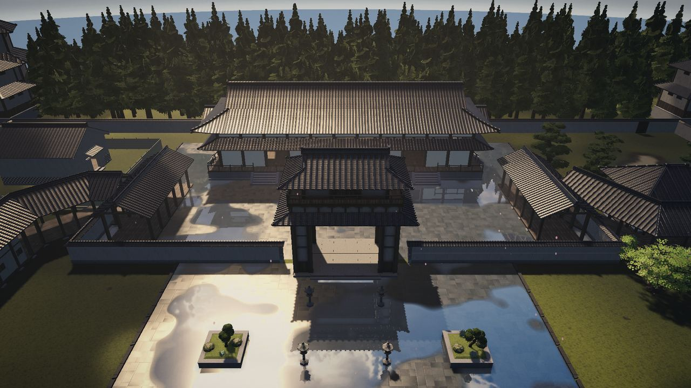
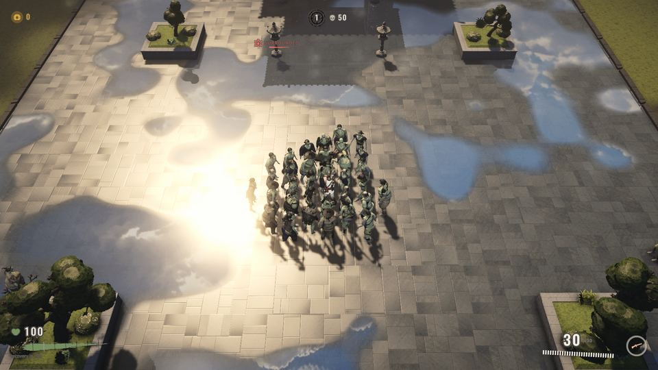
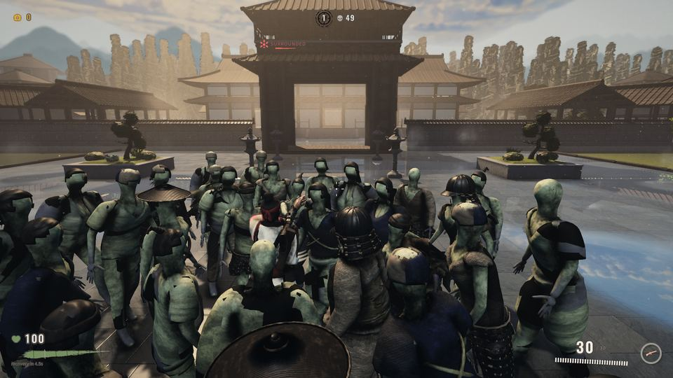
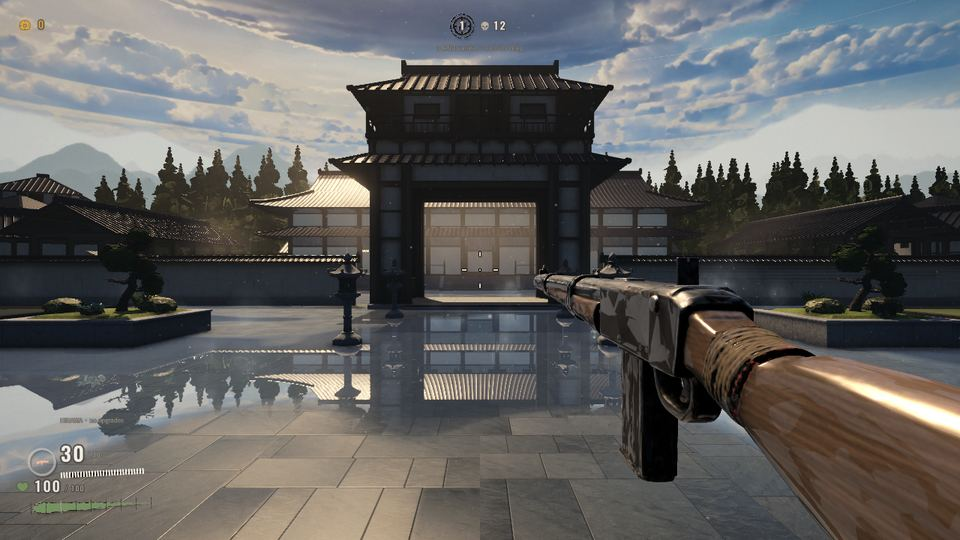
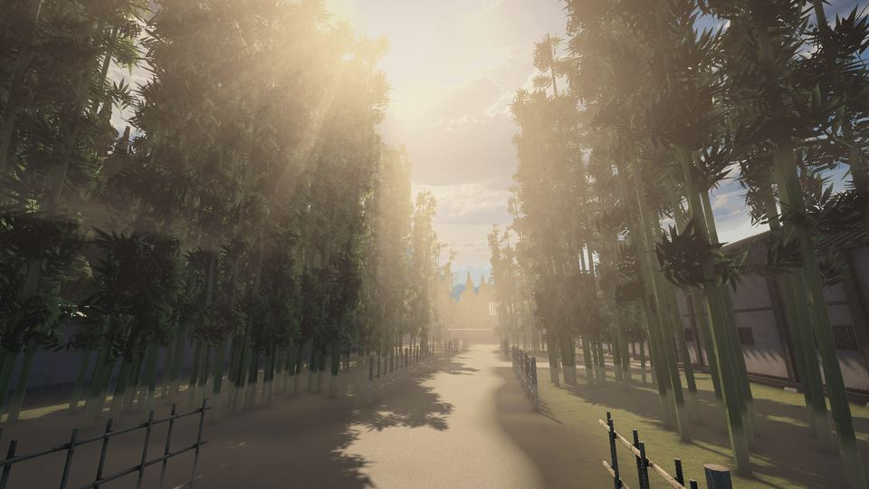
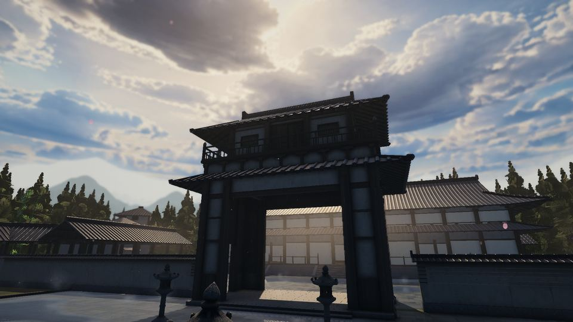
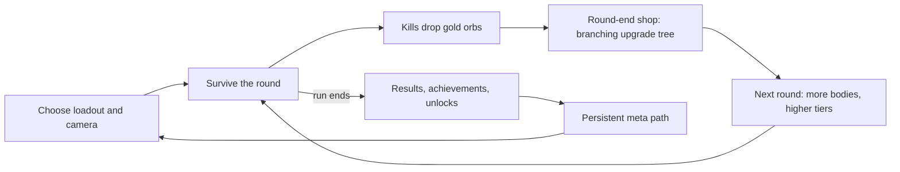
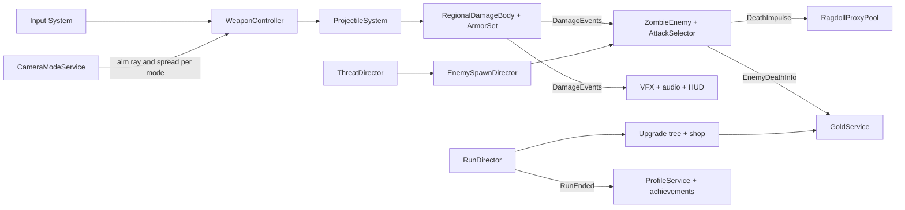

  <h1>DEATHS DEMOLITION</h1>
  
<strong>Wave-survival zombie shooter · Unity 2022.3 LTS · URP · C#</strong>

  

Deaths Demolition is a wave-survival zombie shooter built with Unity and C#. The player holds an old Japanese palace compound against crowds of up to 40 zombies with ten classic weapons and two chain-reaction Specials. Between rounds, gold buys cards from a branching upgrade tree. The top-down, third-person and first-person cameras can be switched at runtime.

> **Status:** active development, milestone M4 (Integration & Polish), revision round M4-R1. M0–M3 are complete. This page presents gameplay screenshots and engineering documentation. The source repository, playable builds and production assets are private.

## Screenshots

  <strong>One run, three cameras, switched at runtime from the pause menu</strong>

  
  
  

  Top-down (default) · third-person over the shoulder · first-person with a viewmodel overlay camera

  <strong>The V6 world: after-rain light and volumetric sun shafts</strong>

  
  

  West bamboo grove, first-person · back-lit toward the sun through the chūmon gate, third-person

## Core gameplay

## Feature set

**Arsenal and combat**
- Ten classic weapons in six classes (assault rifles, SMGs, shotguns, LMGs, a sniper and a rocket launcher). Each is a data-driven `WeaponDefinition` asset with its own spread for each camera mode and its own first-person pose.
- Two original Specials: **Raijū**, a chain-lightning orb that jumps between bodies, and **Namekuji**, a slick gel that makes zombies slide and fall.
- One projectile simulation for everything: bullets, pellets, rockets, orbs and gel. It handles up to 256 live projectiles at a fixed 120 Hz step with swept casts and penetration, and allocates nothing per frame.
- Regional damage with head, upper and lower regions. Helmet, body and leg plates break, and explosions split falloff damage across regions.

**Enemies and AI**
- Four tiers (Standard, Runner, Guard, Executioner) on one data-driven zombie. The tier is data, not a subclass.
- Five attack styles (swipe, lunge, sweep, overhead, bite-grab) picked by a deterministic selector. A crowd slot board caps how many zombies wind up an attack at once, and one strong hit breaks a grab.
- NavMesh paths plus a mass-weighted separation solver on a spatial hash. A threat director drives spawn weighting and the music layers.
- World-aware spawning across 22 authored gates, weighted by path distance, density, visibility and room balance.

**Progression and save**
- The in-run gold tree has 13 branch keystones, 4 Special links and a seal, fork and capstone path for each weapon. The 38-node meta path carries between runs.
- Crash-safe saves: fsync, read-back verification, atomic replace, a verified backup and quarantine for corrupt files. Each finished run is committed exactly once.
- 27 achievements and 9 unlockables, granted exactly once inside the profile commit.

**World, look and feel**
- The world is built by code. The walled palace compound has gates, roofed corridors, a hall, ponds and a bamboo grove, and a vista band of 1,143 trees surrounds it. The whole world can be rebuilt headlessly.
- After-rain lighting with wet surfaces, planar reflection and real volumetric sun shafts (a URP 14 raymarch through the shadow map).
- Pooled muzzle, tracer, casing and impact effects under per-category budgets. A local hit-stop gives weight to hits without touching `Time.timeScale`, and blood is GPU-instanced.
- Five-layer weapon audio. A baked acoustic-space map tells the fire model whether the listener is in the open, a corridor or a hall.
- A code-built "seal and brush" ink HUD that covers about 1 % of the screen. Accessibility options include UI scale, a colour-blind-safe palette, reduced motion and flashes, input remapping and gamepad glyphs.

## Architecture

`Boot` is the only entry scene. It loads `PrototypeConfig`, the single data layer for every tunable, and brings up the persistent services. Gameplay systems communicate through event buses with struct payloads. Producers never know their consumers.

Principles that run through the code:
- **Data before code:** every tunable lives in config sections, ScriptableObjects or JSON catalogs. Placeholder values are tagged and name the open decision.
- **Zero allocations on hot paths:** shots, projectiles, damage events and armour run on pre-allocated buffers, and the project also works with domain reload off.
- **One owner per concern:** one tier authority, one corpse-lifetime owner, one writer of global render settings and one writer of user data.

**Scene flow:** `Boot → MainMenu → Selection → Run (+ World V6) → Results → MainMenu`

## Quality tiers

| Tier | Purpose | Frame target (1080p, reference Mac) |
| --- | --- | --- |
| **Cinematic** (default) | Full volumetric shafts and planar reflection | 30 fps: mean ≤ 33.3 ms, p99 ≤ 40 ms |
| **High** | 60 fps with reduced shafts | mean ≤ 16.6 ms, p99 ≤ 20 ms |
| **Performance** | High refresh rates and weaker GPUs, shafts off | mean ≤ 8.0 ms, p99 ≤ 10 ms |

Each tier sits on its own URP asset. Feature owners read their values from one tier authority and never hard-code them at call sites.

## Engineering profile

| Area | Current snapshot |
| --- | ---: |
| Gameplay C# scripts (`_Prototype`) | 749 |
| Art-pipeline C# scripts (`_Art`) | 138 |
| C# lines, tests included | ≈ 281,000 |
| Automated tests (EditMode + PlayMode) | 1,719 in 7 assemblies |
| Unity / URP | 2022.3.22f1 / 14.0.10 |
| Zombies on screen (round ceiling) | 40 |
| Live projectiles (simulation cap) | 256 |
| Platforms built | macOS (Metal), Windows x64 |
| Network | none, fully offline |

The test suites cover pure logic in EditMode: the attack selector, economy and tree rules, the save chain under fault injection, schema migration and weapon validation. PlayMode tests run vertical slices in real scenes (combat, projectiles, Specials, attack variety and walks through the V6 world), and every PlayMode test runs isolated from the real player profile. A seeded QA bot drives the real menu-to-run flow in all three camera modes.

**Stack:** Unity 2022.3 LTS · URP 14 · C# · NUnit / Unity Test Framework · Input System · AI Navigation · Cinemachine · ProBuilder · zsh/Bash + Python tooling · Blender asset pipeline

## Production pipeline

The game is produced by coordinated AI agent sessions under my direction. I own the design and every product decision.

- **Ten topic sessions** each own one domain: foundation, combat, AI, economy, world, animation, VFX, audio, UI and QA. Asset sessions produce environment, character and weapon packages.
- **A coordinator session** writes work-package specs, relays decisions and integrates. Each package gets a signed design direction from a council of specialist reviewers before it is built.
- **Gates on every change:**
  - a scripted integration gate (allowed paths, secret scan, LFS check, verified cherry-pick);
  - a compile gate;
  - continuous CI on `main` that maps every red test to its owner;
  - a release build with a flagless smoke run.
- **Machine and data safety:** a FIFO machine-slot lock shares one Mac between sessions. A user-data guard snapshots the real player profile before any automated run and restores it afterwards. History is never rewritten.
- **Traceability:** owner decisions (DEC), requirements (REQ) and per-package technical decisions (ADR) are numbered, and code comments cite them.

## In progress

- The M4-R1 revision round: after each release build I play the game, list what is missing, and the list becomes the next round of work packages.
- First-person arms are built (29 clips) but stay disabled until the hand-orientation pass lands.
- A full acceptance run in all three camera modes, with per-tier performance checks and the seeded soak.

---

Copyright © 2026 Erdem Emir Özer. All rights reserved. Screenshots are captured from development builds. No reuse rights are granted.
